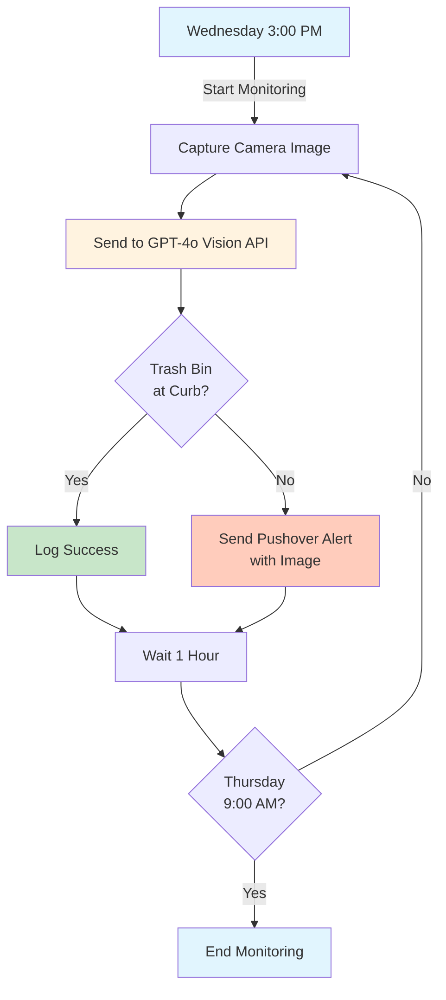

# TrashMinder 🗑️

An intelligent trash bin monitoring system for Home Assistant using AppDaemon and GPT-4 Vision.

## Overview

TrashMinder automatically monitors your trash bin placement using computer vision to ensure you never forget to put your bins out for collection. It captures images from your security camera, analyzes them with GPT-4o to detect if bins are positioned at the curb, and sends push notifications if they're not detected during the collection window.

## How It Works



## Features

- 📷 **Automated Image Capture**: Takes snapshots from your security camera hourly
- 🤖 **AI-Powered Detection**: Uses GPT-4o vision to intelligently detect trash bins near the street
- 📱 **Push Notifications**: Sends alerts via Pushover with attached camera images when bins aren't detected
- ⏰ **Smart Scheduling**: Monitors from Wednesday 3 PM to Thursday 9 AM (customizable)
- 🧪 **Test Mode**: Run checks every minute for testing and validation
- 📊 **Confidence Scoring**: Reports detection confidence levels (high/medium/low)

## Installation

### Prerequisites

1. **Home Assistant** with AppDaemon add-on installed
2. **Camera Entity** configured in Home Assistant (e.g., `camera.front_yard`)
3. **OpenAI API Key** with GPT-4o access https://platform.openai.com/api-keys
4. **Pushover Account** with API token and user key https://pushover.net/

### Step 1: Install and Configure AppDaemon

1. **Install AppDaemon** (if not already installed):
   - Navigate to **Settings** → **Add-ons** → **Add-on Store**
   - Search for "AppDaemon" and install it

2. **Add Required Python Package**:
   - Go to **Settings** → **Add-ons** → **AppDaemon** → **Configuration**
   - Or navigate directly to: http://homeassistant:8123/hassio/addon/a0d7b954_appdaemon/config
   - In the configuration page, add the OpenAI package:
     ```yaml
     python_packages:
       - openai
     ```
   - Click **Save**

3. **Start AppDaemon**:
   - Click **Start** (or **Restart** if already running)
   - The OpenAI package will be installed automatically on startup

### Step 2: Configure Secrets

Add the following to your AppDaemon `secrets.yaml` file:

```yaml
# /addon_configs/a0d7b954_appdaemon/secrets.yaml
openai_api_key: "sk-proj-xxxxxxxxxxxxx"
pushover_user_key: "uxxxxxxxxxxxxx"
pushover_api_token: "axxxxxxxxxxxxx"
```

### Step 3: Install TrashMinder

1. Create the TrashMinder directory:
   ```bash
   mkdir -p /addon_configs/a0d7b954_appdaemon/apps/trashminder
   ```

2. Copy the TrashMinder files:
   - `trashminder.py` → `/addon_configs/a0d7b954_appdaemon/apps/trashminder/trashminder.py`
   - `trashminder.yaml` → `/addon_configs/a0d7b954_appdaemon/apps/trashminder/trashminder.yaml`

3. Update the configuration in `trashminder.yaml`:
   ```yaml
   trashminder:
     module: trashminder
     class: TrashMinder
     
     # Your camera entity ID
     camera_entity: camera.front_yard
     
     # API credentials (stored in secrets.yaml)
     openai_api_key: !secret openai_api_key
     pushover_user_key: !secret pushover_user_key
     pushover_api_token: !secret pushover_api_token
     
     # Schedule configuration (optional - these are the defaults)
     start_day: wed           # Day to start monitoring (mon, tue, wed, thu, fri, sat, sun)
     start_time: "15:00:00"   # Time to start (24-hour format)
     end_day: thu             # Day to end monitoring
     end_time: "09:00:00"     # Time to end (24-hour format)
     
     # Set to true for testing (checks every minute)
     test_mode: false
   ```

### Step 4: Restart AppDaemon

Restart the AppDaemon add-on to load TrashMinder:
1. Go to **Settings** → **Add-ons** → **AppDaemon**
2. Click **Restart**

## Configuration Options

| Parameter | Required | Default | Description |
|-----------|----------|---------|-------------|
| `camera_entity` | Yes | `camera.front_yard` | Home Assistant camera entity ID |
| `openai_api_key` | Yes | - | OpenAI API key for GPT-4o access |
| `pushover_user_key` | Yes | - | Pushover user key for notifications |
| `pushover_api_token` | Yes | - | Pushover API token |
| `start_day` | No | `wed` | Day of week to start monitoring (mon, tue, wed, thu, fri, sat, sun) |
| `start_time` | No | `15:00:00` | Time to start monitoring (24-hour format) |
| `end_day` | No | `thu` | Day of week to end monitoring |
| `end_time` | No | `09:00:00` | Time to end monitoring (24-hour format) |
| `test_mode` | No | `false` | Enable test mode (checks every minute) |

## Testing

Enable test mode to verify everything is working:

1. Set `test_mode: true` in `trashminder.yaml`
2. Restart AppDaemon
3. Check AppDaemon logs for test notifications
4. Verify you receive Pushover notifications with camera images

## Monitoring Schedule

**Normal Mode:**
- Starts: Configurable day and time (default: Wednesday 3:00 PM)
- Ends: Configurable day and time (default: Thursday 9:00 AM)  
- Frequency: Hourly checks with ±5 minute random offset

You can customize the monitoring schedule to match your trash collection day. For example, if your trash is collected on Monday morning, you could set:
- `start_day: sun`
- `start_time: "15:00:00"` 
- `end_day: mon`
- `end_time: "09:00:00"`

**Test Mode:**
- Runs every 60 seconds continuously
- Sends notifications even when bins are detected (for testing)

## Troubleshooting

### Check AppDaemon Logs

View logs to diagnose issues:
```bash
# In Home Assistant terminal
docker logs addon_a0d7b954_appdaemon
```

### Common Issues

1. **"ModuleNotFoundError: No module named 'openai'"**
   - Ensure you added `openai` to the `python_packages` in AppDaemon configuration
   - Restart AppDaemon after adding the package
   - Check AppDaemon logs to confirm the package installed successfully

2. **"No SUPERVISOR_TOKEN found"**
   - Ensure AppDaemon has proper Home Assistant integration
   - Restart the AppDaemon add-on

3. **Camera image capture fails**
   - Verify camera entity ID is correct
   - Check camera is accessible in Home Assistant
   - Ensure AppDaemon has permission to access the camera

4. **GPT-4o API errors**
   - Verify OpenAI API key is valid
   - Check you have GPT-4o access on your OpenAI account
   - Monitor API usage limits

5. **Pushover notifications not received**
   - Verify Pushover credentials are correct
   - Check Pushover app is installed on your device
   - Test Pushover separately using their API

## API Usage & Costs

- **OpenAI GPT-4o**: ~$0.01-0.02 per image analysis
- **Weekly cost estimate**: $0.18-0.36 (18 hourly checks)
- **Monthly cost estimate**: $0.72-1.44

## Privacy & Security

- Images are sent to OpenAI for analysis only
- No images are stored permanently by the app
- API keys are stored in `secrets.yaml` (never commit to git)
- All logs sanitize sensitive information

## Contributing

Feel free to submit issues and enhancement requests!

## License

This project is provided as-is for personal use. Modify and distribute as needed.

## Support

For issues or questions:
1. Check the troubleshooting section
2. Review AppDaemon logs
3. Verify all API credentials and entities

---

*Never forget trash day again! 🗑️*
